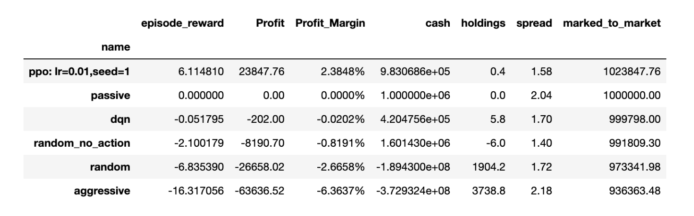

# Capstone Project: Reinforcement Learning for Trading (with JP Morgan Chase & Co)

##  Overview

This capstone project explores how to leverage **Reinforcement Learning (RL)** and **multi-agent simulation environments** to improve the **profitability and efficiency of high-frequency trading (HFT)** strategies. We use a custom simulator based on [ABIDES](https://github.com/abides-sim/abides), integrated with OpenAI Gym, to train intelligent agents using algorithms like **Deep Q-Learning**, **PPO (Proximal Policy Optimization)**, and **LSTM-enhanced neural networks**.

See full Capstone Project report for referance. 

##  Objective

The main objective is to develop and evaluate intelligent trading agents that:
- Learn and adapt through reinforcement learning.
- Interact in a realistic simulated financial market.
- Optimize profitability through enhanced decision-making and achieving return rate higher than baseline.

##  Team
- Charlotte Jin
- Ethan Choukroun
- Jingqi Ma
- Haoyang Wang

## Key Technologies & Frameworks

- Python, Tensorflow
- ABIDES (Agent-Based Interactive Discrete Event Simulator) based on OpenAI Gym
- Deep Q-Network (DQN)
- Proximal Policy Optimization (PPO)
- Long Short-Term Memory (LSTM)
- NumPy, Pandas, Matplotlib (for analysis and visualization)

## Methodology

1. **Simulation Setup:**
   - ABIDES simulates a realistic financial market with multiple trading agents (Sanity check using matrics like stock price, order volumes by best bid and ask, by value and momentum agents)
   - Agents communicate via message-passing with a central exchange agent.

2. **RL Training:**
   - **DQN** is used as a baseline model.
   - **LSTM-enhanced DQN** adds temporal memory to capture long-term dependencies.
   - **PPO** is applied for stable on-policy optimization.

3. **Evaluation:**
   - Performance metrics include episode rewards, profit margins, convergence rates.
   - PPO with LSTM showed a **2.38% daily profit margin**—outperforming baselines and random strategies.

## Results

| Trading Strategy | Profit Margin |
|------------------|----------------|
| PPO + LSTM       | **+2.38%**     |
| DQN              | -0.02%         |
| Random           | -2.65%         |
| Aggressive       | -6.36%         |

- LSTM accelerated convergence and improved stability.
- PPO was more sample-efficient and robust compared to DQN.

## References
- [ABIDES-Gym: Gym Environments for Multi-Agent Discrete Event Simulation and Application to Financial Markets](https://arxiv.org/abs/2110.14771)
- [An Reinforcement Learning Approach Integrating Diverse Policies for Portfolio Optimization](https://arxiv.org/abs/2210.01774)
- [Playing Atari with Deep Reinforcement Learning](https://arxiv.org/abs/1312.5602)
- [OpenAI Gym](https://arxiv.org/abs/1606.01540)
